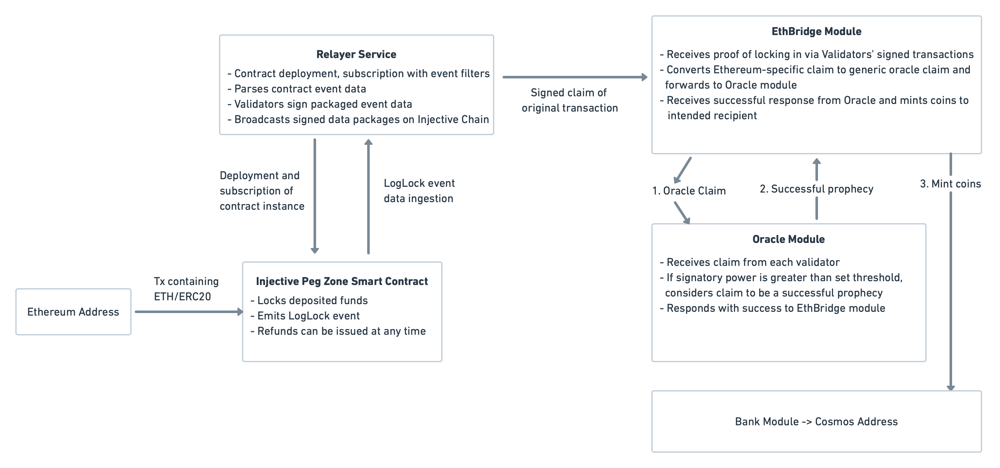

# Injective Chain

The Injective Chain is an fully-decentralized sidechain relayer network which serves as a layer-2 derivatives platform, trade execution coordinator \(TEC\), and decentralized orderbook. The consensus is Tendermint-based and the core protocol logic is implemented through Cosmos-SDK modules. 

# Layer-2 Scalability

The Injective Chain provides a two-way Ethereum peg-zone for Ether and ERC-20 tokens to be transferred to the Injective Chain as well as an EVM-compatible execution environment for DeFi applications. The peg-zone is based off [Peggy](https://github.com/cosmos/peggy) and the EVM execution is based off [Ethermint](https://github.com/chainsafe/ethermint).

## Ethereum ⮂ Injective Peg Zone

Both ETH and ERC-20 tokens can be transferred to and from Ethereum to the Injective Chain through the Injective Peg Zone. The process to do so follows the standard flow as defined by Peggy. 

### Ethereum → Injective Chain

The following is the underlying process involved in transferring ETH/ERC-20 tokens from Ethereum to the Injective Chain. Validators witness the locking of Ethereum/ERC20 assets and sign a data package containing information about the lock, which is then relayed to the Injective chain and witnessed by the EthBridge module. Once a quorum of validators have confirmed that the transaction's information is valid, the funds are released by the Oracle module and transferred to the intended recipient's address. In this way, Ethereum assets can be transferred to Cosmos-SDK based blockchains.

This process is abstracted away from the end user, who simply needs to transfer their ETH/ERC-20 to the Injective Peg Zone contract. 

On a high level, the transfer flow is as follows:

1. User sends ETH/ERC-20 to the Injective Bridge Contract, emitting a LogLock event. 
2. An Injective relayer listening to the event creates and signs a Tendermint transaction encoding this information which is then broadcasted to the Injective Chain. 
3. The nodes of the Injective Chain verify the validity of the transaction. 
4. New tokens representing the ETH/ERC-20 are minted in the [`bank`](https://docs.cosmos.network/master/modules/bank/) module. 

Thereafter, the ETH/ERC-20 can be used on Injective Chain's EVM as well as in the Cosmos-SDK based application logic of the Injective Chain. In the future, the Injective chain will support cross-chain trades using Cosmos IBC. 

### Injective Chain → Ethereum

 The following is the underlying process involved in transferring ETH/ERC-20 tokens from the Injective Chain to Ethereum. 

Validators witness transactions on the Injective Chain and sign a data package containing the information. The user's ETH/ERC-20 on the Injective Chain is burned, resulting in unlocking the ETH/ERC-20 on Ethereum. The data package containing the validator's signature is then relayed to the contracts deployed on the Ethereum blockchain. Once enough other validators have confirmed that the transaction's information is valid, the funds are released/minted to the intended recipient's Ethereum address. 

## EVM Execution Environment

The Injective Chain EVM is a geth based EVM implemented as a custom Cosmos-SDK module (akin to Ethermint). 

The user and developer experience for deploying and interacting with contracts on the Injective EVM will be the same, and all of the Ethereum RPC methods will be supported on the Injective EVM. 

This area is under active development and more documentation and developer guides will be released shortly. 

# Trade Execution Coordinator

The Injective Trade Execution Coordinator \(TEC\) is a decentralized coordinator implementation based off the [0x 3.0 Coordinator](https://github.com/0xProject/0x-protocol-specification/blob/master/v3/coordinator-specification.md) specification. The Injective TEC safeguards trades from front-running using Verifiable Delay Functions and enables lower-latency trading through soft-cancellations.

# Decentralized Orderbook

Injective's Decentralized Orderbook is a fully decentralized 0x-based orderbook enabling **sidechain order relay with on-chain settlement** - a decentralized implementation of the traditionally centralized [off-chain order relay](https://github.com/0xProject/0x-protocol-specification/blob/master/v2/v2-specification.md#architecture) used by nearly all central limit order book decentralized exchanges.

Nodes of the Injective Chain host a decentralized, censorship-resistant orderbook which stores and relays orders.

<!---The Injective sidechain hosts a decentralized, censorship-resistant orderbook which stores and relays orders and also serves as a decentralized trade execution coordinator \(TEC\).--->

<!---Each node of the Injective chain runs RelayerDaemon which maintains a decentralized orderbook and trade execution coordinator. Users can interact with the node directly through Tendermint transactions or through the [RelayerAPI](https://api.injective.dev/#operation/Relayer#getAccount) which relayers can optionally support. --->
